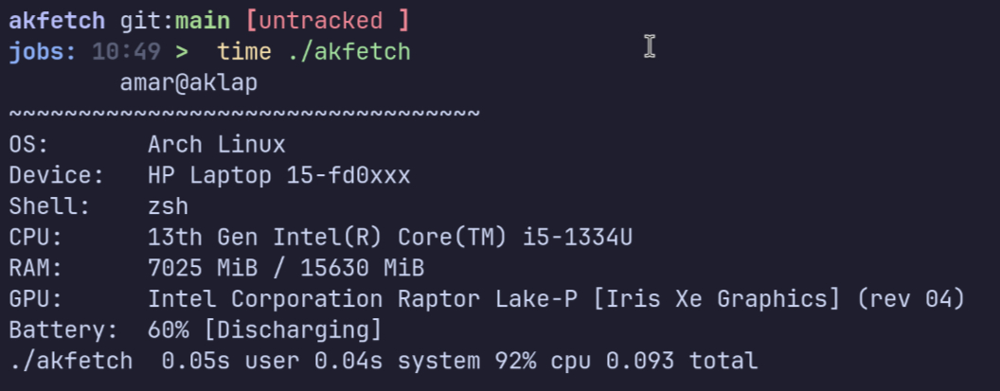

# akfetch

## A minimal, fast alternative to Fastfetch
## No icon, No Bloat, Just the Neccessary Details.

---
## Why akfetch?

Most fetch tools like fastfetch, neofetch are too bloated and displays excessive details which most people dont need.
### What akfetch does?
- Shows only essential details
- Clean and Professional output
- Written in 'C' style C++ code.
---
## Performance
`fastfetch` --> `0.642s` <br>
`akfetch` --> `0.093s`

`Note: it may not be a big difference here but writting a production ready code anytime is the GOAL here`

---
## Features

- OS detection
- Device information
- Shell detection
- CPU info
- RAM usage
- GPU detection
- Battery status
- Clean user@host display
---
## Build
```bash
g++ -O3 -march=native -flto -pipe -s main.cpp -o akfetch
```
**Run**
```bash
./akfetch
```
---
## License
**MIT**
